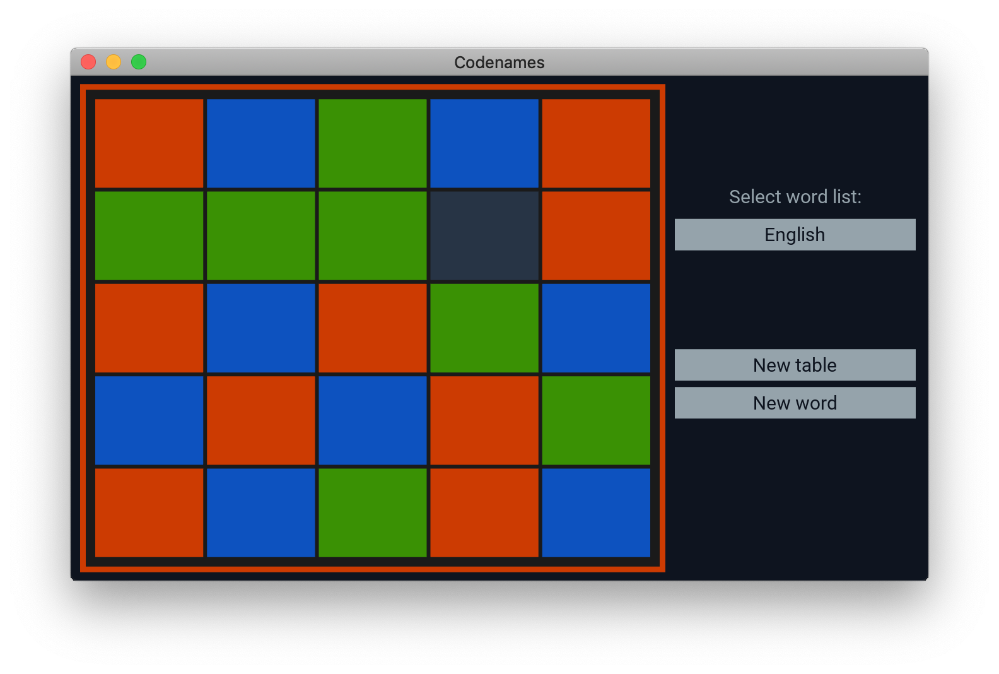

# Codenames - Kivy

Table and word list generator for the popular [Codenames](https://czechgames.com/en/codenames/) boardgame, created in Python 3 using [Kivy](https://kivy.org/).

## Installation

First of all, you need to [install the Kivy project](https://kivy.org/#download) and its dependencies. Once Kivy is installed, all you need to do is clone the repository or download the source code.

## Getting started

When everything is in place, you can start the application by executing `main.py` using Python 3: `python main.py` or `python3 main.py`.

## Word lists

The application needs a word list to be able to suggest words randomly to you so you can set up a board. Some word lists are included in this project (nouns listed on Wikipedia), see the [wordlists](./wordlists) directory.

The application will read words from the `wordlist.txt` file that is next to the application. This word list file is empty by default, it's up to you to fill it with words by either copying the content of one of the included word files to `wordlist.txt` or by acquiring a word list from some other source.

## Legal notice

This code has been open sourced after written permission from the [publisher](https://czechgames.com/en/), Czech Games Edition.

## License - GNU AGPLv3+

Because of the aforementioned legal notice, the project is open sourced under the conditions of the [GNU AGPLv3+ license](https://choosealicense.com/licenses/gpl-3.0/).
